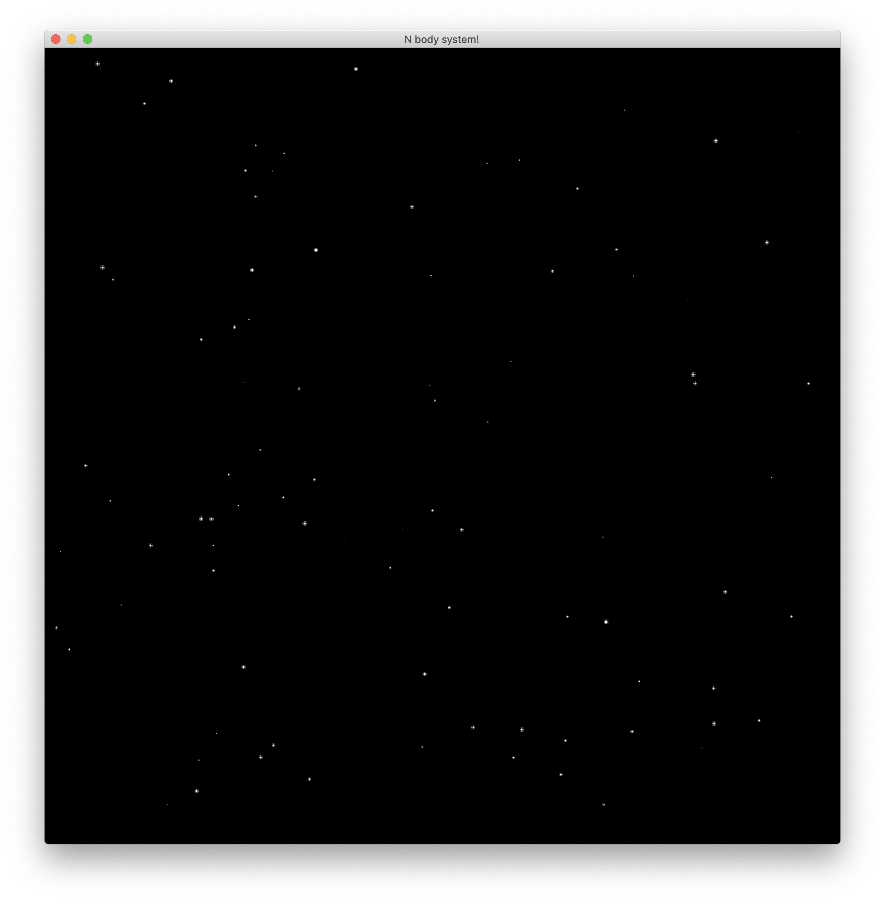

# N-body system
This is a Barnes-Hut simulation of a n-body system. The Barnes-Hut algorithm is an approximation algorithm used for high performance simulations. It is notable for having order O(nlogn) compared to a direct-sum algorithm which would be O(n^2). 
To know more about how the algorithm works, check out this awesome [article](http://arborjs.org/docs/barnes-hut)

# Get Started
- `cargo build`
- `cargo run`

This project uses [Amethyst Game Engine](https://amethyst.rs/) which supports both `Vulkan` and `Metal` rendering backends. This project uses `metal`, but if you are on Windows, update `cargo.toml` to set the features entry in the amethyst dependency table to `vulkan`.

*Note: This project needs some more love and care to reach completion. That said, bodies do experience force and fly around!*

# Run tests
- `cargo test`